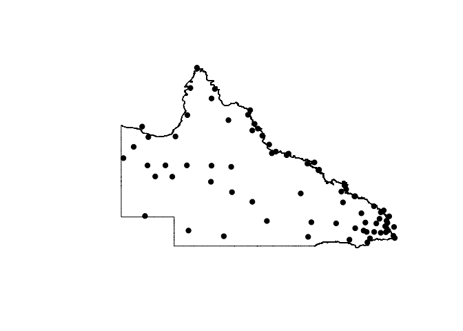

Pull Data from Silo
================

``` r
#headers for SILO file
headers <- c("Date", "Day", "Date2", "T.Max", "Smx", "T.Min", "Smn", "Rain",
             "Srn", "Evap", "Sev", "Radn", "Ssl", "VP", "Svp", "RHmaxT",
             "RHminT", "FAO56")


#get site details from the csv file

spatial <- readr::read_csv("BoM_ETA_20150501-20160430/spatial/StationData.csv")
spatial <- spatial[spatial$REGION == "QLD", ]

head(spatial)
```

    ##     WMO_NUM station_number   station_name LATITUDE LONGITUDE  STN_HT
    ## 147   94170          27045     WEIPA AERO -12.6778  141.9208  17.960
    ## 148   94182          27054 COCONUT ISLAND -10.0511  143.0686   3.500
    ## 149   94174          27058    HORN ISLAND -10.5844  142.2900   4.000
    ## 150   94183          27073   COEN AIRPORT -13.7606  143.1183 159.300
    ## 151   94171          27075  SCHERGER RAAF -12.6167  142.0869  39.341
    ## 152   94276          28004    PALMERVILLE -16.0008  144.0758 203.800
    ##     AVIATION_ID REGION GridPt Lat GridPt Lon MSAS elevation
    ## 147        YBWP    QLD     -12.66     141.92          13.04
    ## 148        YCCT    QLD     -10.03     143.08           0.00
    ## 149        YHID    QLD     -10.57     142.29           7.56
    ## 150        YCOE    QLD     -13.74     143.13         159.44
    ## 151        YBSG    QLD     -12.62     142.08          30.92
    ## 152        YPVI    QLD     -15.99     144.08         215.56
    ##     Distance from GridPt Roughness Distance from coast    Category
    ## 147                  1.3       7.8                  10       coast
    ## 148                  1.9       0.0                 -22         sea
    ## 149                  0.2       8.0                   6       coast
    ## 150                  1.4      38.3                  50 flat_inland
    ## 151                  1.0      11.6                  27 flat_inland
    ## 152                  0.8      28.1                 143 flat_inland
    ##     forecast_district sa_special
    ## 147         QLD_PW001       <NA>
    ## 148         QLD_PW001       <NA>
    ## 149         QLD_PW001       <NA>
    ## 150         QLD_PW001       <NA>
    ## 151         QLD_PW001       <NA>
    ## 152         QLD_PW001       <NA>

``` r
testdf <- data.frame(site = NA, run = NA)

# check access to each site

tryCatch(for (station_number in spatial$station_number) {
  site_number <- as.character(station_number)
  URL <- paste("https://www.longpaddock.qld.gov.au/cgi-bin/silo/PatchedPointDataset.php?format=fao56&station=", site_number, "&start=20160101&finish=20160102&username=USQKEITH&password=KEITH4350")
  URL <- gsub(" ", "", URL) 
  site_data <- read.table(URL, skip = 16)
  testdf <- rbind(testdf, c(station_number, site_data[1, 1]))
}, error = function(x) cat(paste0("\nYou've reached the end of stations available in this data set. The testdf data frame is complete.")))
```

    ## 
    ## You've reached the end of stations available in this data set. The testdf data frame is complete.

``` r
testdf <- subset(testdf, run == 15)

# Select only stations that are available from SILO
spatial <- spatial[spatial$station_number %in% testdf$site, ]

number_of_sites <- length(spatial$station_number)
number_of_sites
```

    ## [1] 75

``` r
QLD_SILO_and_hourly_stations <- spatial

devtools::use_data(QLD_SILO_and_hourly_stations, overwrite = TRUE, compress = "bzip2")
```

    ## Saving QLD_SILO_and_hourly_stations as QLD_SILO_and_hourly_stations.rda to /Users/asparks/Development/JohnConner/data

``` r
# establish the dates to be working within
# enter how many days to look back

dates <- c("2015-04-30", "2016-04-29")
dates <- gsub("-", "", dates)

# creates the data cube
SILO_array <- array(data = NA, dim = c(366, 18, number_of_sites),
                  dimnames = list(NULL, headers, spatial$station_number))

for (i in spatial$station_number) {
  site_number <- as.character(i)
  URL <- paste0("https://www.longpaddock.qld.gov.au/cgi-bin/silo/PatchedPointDataset.php?format=fao56&station=", i, "&start=", dates[1], "&finish=", dates[2], "&username=USQKEITH&password=KEITH4350")
  site_data <- read.table(URL, skip = 41)
  colnames(site_data) <- headers
  site_data <- data.matrix(site_data) 
  SILO_array[,, site_number] <- site_data 
}
devtools::use_data(SILO_array, overwrite = TRUE, compress = "bzip2")
```

    ## Saving SILO_array as SILO_array.rda to /Users/asparks/Development/JohnConner/data

``` r
#libarys required for mapping
library("reshape")
library("fields")
```

    ## Loading required package: spam

    ## Loading required package: grid

    ## Spam version 1.3-0 (2015-10-24) is loaded.
    ## Type 'help( Spam)' or 'demo( spam)' for a short introduction 
    ## and overview of this package.
    ## Help for individual functions is also obtained by adding the
    ## suffix '.spam' to the function name, e.g. 'help( chol.spam)'.

    ## 
    ## Attaching package: 'spam'

    ## The following objects are masked from 'package:base':
    ## 
    ##     backsolve, forwardsolve

    ## Loading required package: maps

``` r
library("RgoogleMaps")

#plot qld outline and the surface over the top of surface
yaxis <- c(-30, -10)
xaxis <- c(135, 155)
border2 <- read.csv("qld2.csv")
border <- read.csv("qld.csv")

plot(border$x, border$y, type = "n", axes = "False", xlim = xaxis, ylim = yaxis,
     xlab = "", ylab = "")
polygon(border2$x, border2$y, col = "white", border = "white")
polygon(border$x, border$y)

#add the stations to the plot
points(spatial$LONGITUDE, spatial$LATITUDE, type = "p", pch = 19)
```


